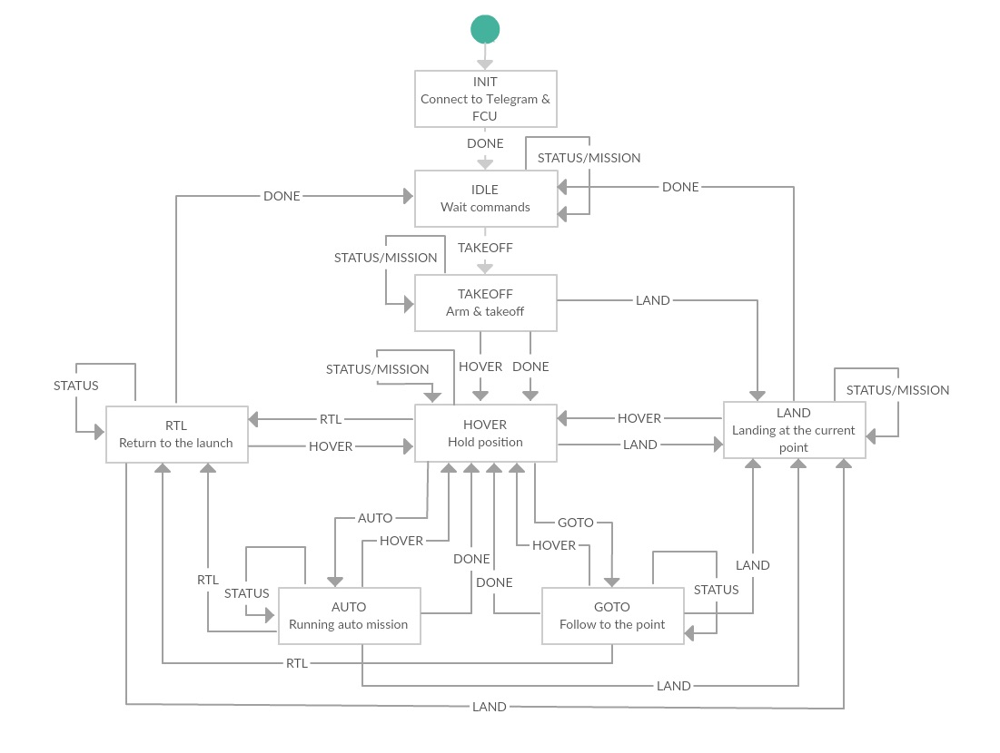

# Autocopter

Firstly Autoсopter was developed as the Telegram bot works on a Raspberry Pi. There is allow control your APM compatible copter throw Telegram messenger. You can see how that was worked on [youtube](https://youtu.be/CE9x4rPizvQ) (russian audio).

Now I made decision that Autocopter must be the framework. There are consists of two components: `states` and `tasks`. For example `state` it's high level logic for make fly to the point, make land & etc. And `task` it's high level logic for make flight mission such as delivery missions, monitoring misssions & etc. Tasks may used sets of states in self program.

This software must be running on companion computer connected to APM using Serial (USB), TCP or UDP. Recommended embedded platform is Raspberry Pi.

For configure internet on your drone (Raspberry Pi) use [modem_keeper](https://github.com/urpylka/modem_keeper).


## Install

For creating config you will need:

* token – Write to `@BotFather` in your Telegram client.
* proxy - Simple HTTP proxy. Needs only if `api.telegram.org` not available, else use `null`.
* chat_id - Run `tests/telepot_test.py` and write to bot via your Telegram client. After you'll see chat id in the console.
* connection_string - Read [the dronekit manual](http://python.dronekit.io/guide/connecting_vehicle.html).

Execute script:
```bash
git clone https://github.com/urpylka/autocopter.git

# Installing python requirements
pip install -r autocopter/requirements.txt

# Creating config
cat <<EOF | sudo tee $(pwd)/autocopter/autocopter.json > /dev/null
{
    "telegram":
    {
        "token":"YOUR_TOKEN",
        "proxy":"YOUR_TELEGRAM_HTTP_PROXY_OR_null",
        "chat_id":"YOUR_CHAT_ID",
        "debug":"True"
    },
    "autocopter":
    {
        "connection_string":"/dev/ttyACM0"
    }
}
EOF

# Creating service
cat <<EOF | sudo tee /lib/systemd/system/autocopter.service > /dev/null
[Unit]
Description=Autocopter

[Service]
ExecStart=$(pwd)/autocopter/autocopter.py $(pwd)/autocopter/autocopter.json
Restart=on-abort

[Install]
WantedBy=multi-user.target
EOF

sudo systemctl enable autocopter
sudo systemctl start autocopter
```

## Manual launch

```bash
# Stop daemon if running
sudo systemctl stop autocopter

python autocopter/autocopter.py "CONNECTION_STR" "BOT_TOKEN" "CHAT_ID" "PROXY" "DEBUG"

# or
python autocopter/autocopter.py "PATH_TO_CONFIG"
```

## Finite State Machine

The program is based on the state machine.



## MAVGateway, a service for runing MAVProxy

As an option, you can install MAVProxy for connecting your APM with many agents (i.e. laptop, dronekit).

```bash
cat <<EOF | sudo tee /lib/systemd/system/mavgateway.service > /dev/null
[Unit]
Description=MAVGateway

[Service]
ExecStart=/usr/local/bin/mavproxy.py --master=/dev/ttyAMA0,57600 --out=tcpin:0.0.0.0:5760 --out=tcpin:127.0.0.1:14600 --daemon
Restart=on-abort

[Install]
WantedBy=multi-user.target
EOF

sudo systemctl enable mavgateway
sudo systemctl start mavgateway
```

## TODO

* Подумать и мб переделать стуктуру? Вынести States?
* Подумать как связать с ros: через класс общий для dronekit и mavros?
